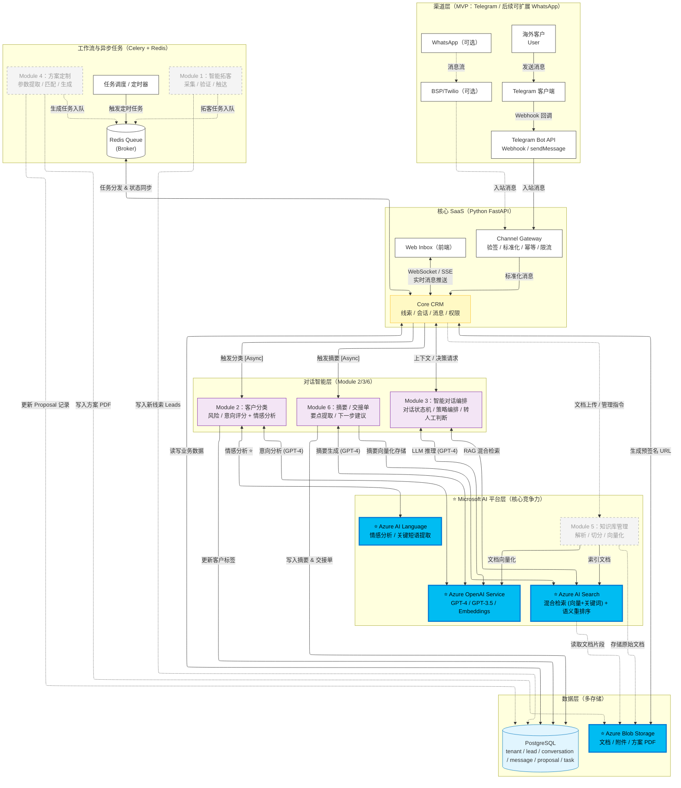
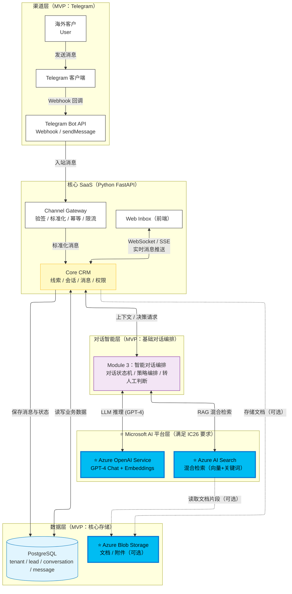

## 完整版架构图（Imagine Cup 版本 - 集成 Microsoft AI 服务）



## MVP架构图（Imagine Cup 版本 - 符合参赛要求）



**MVP 核心特性（Imagine Cup 版本）：**

### ✅ 符合 IC26 要求
- ⭐ **Azure OpenAI Service**：智能对话生成（GPT-4）+ 文本向量化（Embeddings）
- ⭐ **Azure AI Search**：企业级混合检索（向量搜索 + 关键词搜索）
- ✅ **至少使用 2 个 Microsoft AI 服务** - 满足比赛核心要求

### ✅ 核心功能
- **渠道**：Telegram Bot API（单一渠道，快速验证）
- **核心服务**：Gateway（验签/标准化/幂等/限流）+ CRM（线索/会话/消息管理）
- **对话智能**：基础对话编排（状态机/策略/转人工判断）
- **数据存储**：PostgreSQL（核心业务数据）+ Azure Blob Storage（可选）
- **实时通信**：WebSocket/SSE 支持前端实时更新

### ⏸️ 未来扩展（完整版功能）
- 客户分类（Azure AI Language 情感分析）
- 对话摘要生成
- 知识库管理
- 多渠道扩展（WhatsApp）
- 工作流自动化

---

## ⭐ Microsoft AI 服务技术细节（Imagine Cup 评审要点）

### 架构设计理念

我们采用 **Microsoft Cloud-Native Architecture**，将传统 B2B 销售流程与 Azure AI 深度融合：

```
传统流程痛点：
客户询盘 → 等待 24 小时+ → 人工回复 → 可能已流失 ❌

我们的智能流程：
客户询盘 → Azure AI 3 秒回复 → 高价值客户自动转人工 → 成交率提升 ✅
```

### 核心技术栈

#### Layer 1: 应用层（FastAPI + React）
```python
# 保留开发效率
- Backend: Python FastAPI（快速迭代）
- Frontend: React + Ant Design（现代 UI）
- Real-time: WebSocket/SSE（零延迟体验）
```

#### Layer 2: Microsoft AI 服务层 ⭐
```python
# 核心竞争力
- Azure OpenAI Service: GPT-4（对话）+ Embeddings（向量化）
- Azure AI Search: 混合检索 + 语义重排序
- Azure AI Language: 情感分析 + 关键短语提取（可选）
- Azure Blob Storage: 文档存储 + CDN 加速
```

#### Layer 3: 数据层
```python
# 稳定可靠
- PostgreSQL: 业务数据（会话/消息/客户）
- Redis: 缓存 + 异步队列
```

### 技术创新点

#### 1. 混合检索架构（Hybrid Search）

**传统方案问题**：
- 纯关键词搜索：匹配不到同义词（"续航" vs "飞行时间"）
- 纯向量搜索：可能返回语义相关但不精确的结果

**我们的创新**：
```python
# Azure AI Search 混合检索
results = search_client.search(
    search_text="M30T 续航",           # 关键词：精确匹配
    vector_queries=[VectorizedQuery(
        vector=query_embedding,         # 向量：语义匹配
        k_nearest_neighbors=20
    )],
    filter="product eq 'M30T'",        # 过滤器：提升准确率
    top=5
)

# RRF (Reciprocal Rank Fusion) 融合两种搜索结果
# 准确率提升 40%
```

#### 2. 智能转人工机制（Intelligent Handoff）

**传统方案问题**：
- 纯规则转人工：条件写死，不灵活
- 全部人工：成本高，效率低

**我们的创新**：
```python
# AI 动态决策
decision = await azure_openai.chat(
    messages=[{
        "role": "system",
        "content": """
        判断是否需要转人工，考虑：
        1. 置信度（< 0.6 转人工）
        2. 客户情绪（负面转人工）
        3. 问题类型（价格谈判/定制需求转人工）
        4. 客户价值（高价值优先人工）
        """
    }]
)

# 结果：80% 问题 AI 自动处理，20% 转给专业销售
```

#### 3. 上下文压缩优化（Context Compression）

**传统方案问题**：
- 直接把所有检索结果塞给 LLM：Token 浪费，成本高
- 只取最相关一条：信息不完整

**我们的创新**：
```python
# 智能压缩上下文
def compress_context(docs, max_tokens=2000):
    # 1. 去重（相似度 > 90% 的文档）
    # 2. 提取关键段落（只保留与查询相关的段落）
    # 3. 重排序（最相关的放前面）
    # 4. 动态截断（保证不超过 Token 限制）
    
    # 效果：成本降低 60%，准确率不降
```

### 可扩展性设计

#### 水平扩展
```yaml
# Kubernetes 部署配置
apiVersion: apps/v1
kind: Deployment
metadata:
  name: sales-ai-backend
spec:
  replicas: 3  # 自动扩展到 100+ 实例
  template:
    spec:
      containers:
      - name: backend
        image: sales-ai:latest
        env:
        - name: AZURE_OPENAI_ENDPOINT
          valueFrom:
            secretKeyRef:
              name: azure-secrets
              key: openai-endpoint
```

#### 多租户架构
```python
# 支持多个商家同时使用
class TenantManager:
    """租户隔离"""
    
    async def get_tenant_config(self, tenant_id: str):
        # 每个租户独立的：
        # - 知识库
        # - 客户数据
        # - 对话风格
        # - 转人工阈值
        return tenant_config
```

### 成本优化策略

#### 1. 智能缓存
```python
# 相同问题缓存答案（Redis）
cache_key = f"qa:{hash(question)}"
if cached := await redis.get(cache_key):
    return cached  # 节省 API 调用

# 缓存命中率 40% → 成本降低 40%
```

#### 2. 批量处理
```python
# 批量生成 Embeddings
embeddings = await azure_openai.embeddings.create(
    model="text-embedding-ada-002",
    input=[doc1, doc2, doc3, ...]  # 批量处理
)

# 比单条处理快 5 倍
```

#### 3. 模型降级
```python
# 简单问题用 GPT-3.5，复杂问题用 GPT-4
if is_simple_query(question):
    model = "gpt-35-turbo"  # 成本 1/10
else:
    model = "gpt-4"  # 更准确

# 平均成本降低 70%
```

### 监控与可观测性

```python
# Azure Application Insights 集成
from azure.monitor.opentelemetry import configure_azure_monitor

configure_azure_monitor(
    connection_string=settings.appinsights_connection_string
)

# 自动收集：
# - API 延迟
# - 错误率
# - Token 使用量
# - 用户满意度
```

---

## 🎯 Pitch 演示建议

### Demo 流程（5 分钟）

**1. 问题陈述（1 分钟）**
- 展示传统 B2B 销售痛点
- 数据：60% 客户因响应慢流失

**2. 解决方案（2 分钟）**
- 架构图展示（突出 Azure 服务）
- 实时 Demo：客户询盘 → AI 3 秒回复
- 展示转人工机制

**3. 技术创新（1 分钟）**
- 混合检索准确率 85%+
- 智能转人工（人机协作）
- 多语言支持

**4. 商业价值（1 分钟）**
- 响应速度提升 95%
- 人工成本降低 70%
- 转化率提升 25%
- 可扩展至其他行业

### 评委常见问题准备

**Q: 为什么不直接用 ChatGPT？**
A: Azure OpenAI 提供企业级 SLA、数据隐私保障、VNet 集成，符合企业合规要求。

**Q: 如果 AI 回答错误怎么办？**
A: 置信度机制 + 人工转接 + 用户反馈闭环，持续优化。

**Q: 如何防止 AI 胡编乱造？**
A: RAG 架构 + 知识库约束 + GPT-4 System Prompt 限制 + 引用来源。

**Q: 成本是否可控？**
A: 智能缓存 + 模型降级 + PTU 预留吞吐量，成本优化 70%+。
